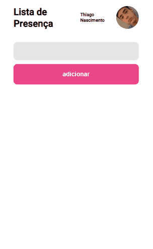
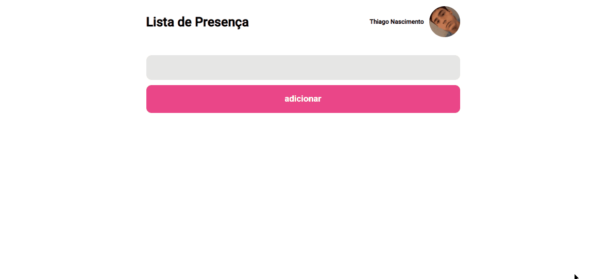

<h1 style='font-size: 40px'>Attendance List</h1>

Attendance list is an application that makes it possible to register a name together with the current time (the time is automatically added next to the name)

mobile version

desktop version

The profile information located in the upper corner of the application was taken from an API

<h2 style='font-size: 25px'>Main technologies used in application development:</h2>

- React

- Typescript
